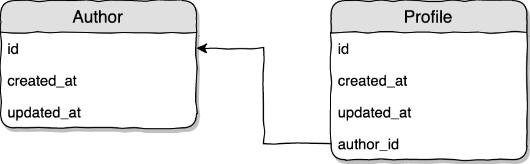

### One-to-One relations

An example one-to-one relation diagram:


In the example above each `Author` model has one `Profile`.

The relation on `Profile` model:

```
class Profile extends Model
{
    public function author()
    {
        return $this->belongsTo('App\Author');
    }
}
```

Relation on `Author` model:

```
class Author extends Model
{
    public function profile()
    {
        return $this->hasOne('App\Profile');
    }
}
```

`Author` model migration:

```
Schema::create('authors', function (Blueprint $table) {
    $table->increments('id');
    $table->timestamps();
});
```

`Profile` model migration:

```
Schema::create('profiles', function (Blueprint $table) {
    $table->increments('id');
    $table->timestamps();

    $table->unsignedInteger('author_id');
    $table->foreign('author_id')->references('id')->on('authors');
});
```        

#### Database design



With one-to-one relation, 1 record from first table (eg. `authors`) has exactly 1 matchting record on the other table (eg. `profiles`).

One of the tables needs to have a column, that will hold the `id` of the record on the other table.

In our example, we have `authors` and `profiles`. Since it makes no sense for a `Profile` to exist on it's own, the relation column (`author_id`) is put on the `profiles` table.

In short:

* has* - methods on Models that own the relation, no relation column
* belongs* - methods on Models that are other side of the relation, with relation column

#### Accessing related object

1) Accessing the relation on already loaded model

```
use App\Author;

$author = Author::find(1);   // Load author model
$profile = $author->profile; // Load the relation (separate query is made)

$profile = Profile::find(1);
$author = $profile->author;
```

The `method` name defining a relation is accessed as a `field` with the same name as the `method` name.

This is called `Lazy Loading`. Relations are only loaded from database when they are accessed for the 1st time.

2) Loading the model with 1 relation at once

```
use App\Author;

$author = Author::with('profile')->whereKey(1)->first();
```

The `Model::find()` is a actually a shortcut [view source](https://github.com/laravel/framework/blob/5.7/src/Illuminate/Database/Eloquent/Builder.php#L323)

That behind the scenes does this:

```
return $this->whereKey($id)->first($columns);
```

3) Loading the model with many relations at once

```
use App\Author;

$author = Author::with(['profile', 'account'])->whereKey(1)->get();
```