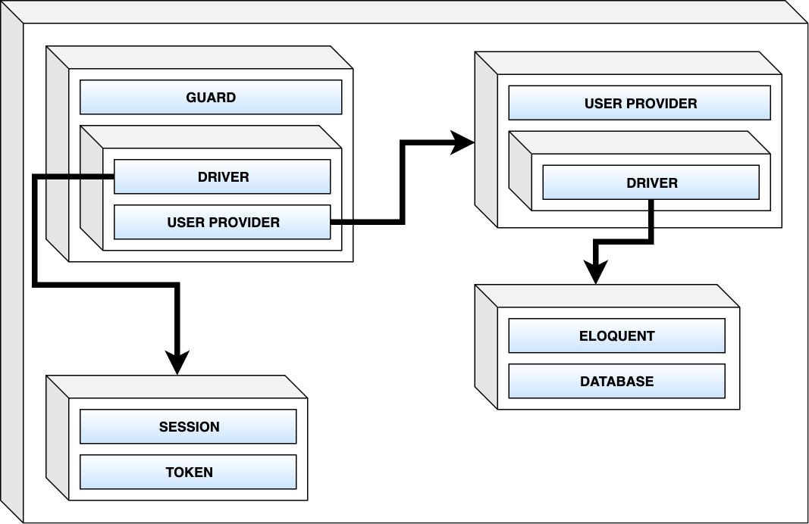

## Authentication

### Authentication component

Below is a diagram of Laravel Authentication component:

The main component responsible for authenticating users is called **Guard**.

**Guard** has 2 components:

* Driver (how to handle user authenticated state - keep in session/read from token)
* User Provider (where to find user accounts)

**User Provider** is responsible for fetching users from certain storage (usually a database).

**User Provider** also has a **Driver**, it can be:

* Database (fetching users using raw SQL query)
* Eloquent (use User model to fetch the user)

Laravel has some sensible defaults configured out of the box. There are 2 guards:

* **web** (for traditional web applications, using session to store currently authenticated user)
* **api** (for APIs, stateless - no session is kept between request, each request needs to include a valid token to authenticate user)

The default Laravel guard is **web**.

### Default login flow

Below is the diagram of how logging in works by default:

