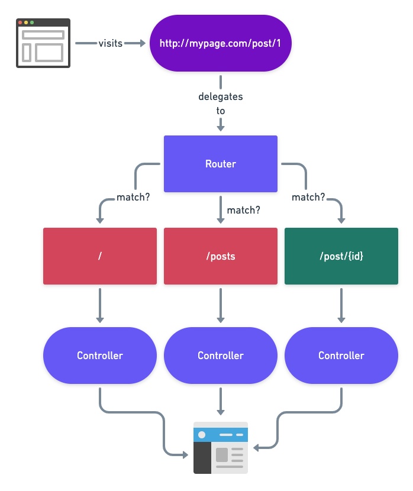
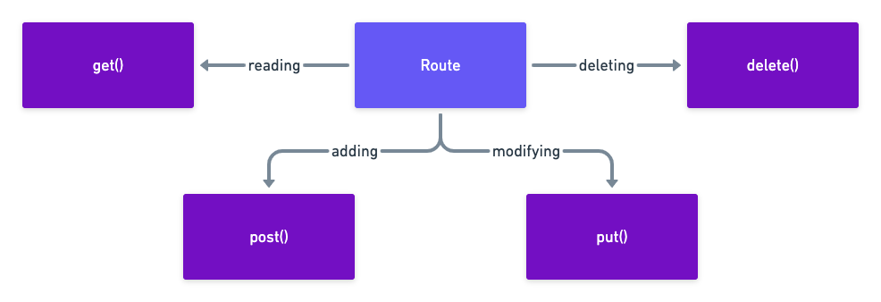

### How routing works (diagram)


### HTTP verb methods on Route class (diagram)


### Inside route definition file (routes/web.php)

Defining a route using closure

```php
Route::get('/', function () {
    return view('welcome');
});
```

Defining a route that only renders a Blade template

```php
Route::view('/home'); // Without parameters
Route::view('/home', ['data' => 'value']); // With parameters
```

Route with a required parameter

```php
Route::get('/page/{id}', function ($id) {
    return view('page', ['page' => $id]);
});

// Using Arrow Functions (Since PHP 7.4)
Route::get('/page/{id}', fn ($id) => view('page', ['page' => $id]));
```

Route with an optional parameter

```php
Route::get('/hello/{name?}', function ($name = 'Guest') {
    return view('hello', ['name' => $name]);
});

// Using Arrow Functions (Since PHP 7.4)
// For optional route parameter {name}, the Closure argument has to have a default value provided
Route::get('/hello/{name?}', fn ($name = 'Guest') => view('hello', ['name' => $name]));
```

Named route (to give the route a name, you would chain a `name()` method call)

```php
Route::view('/home')->name('home');
```

Generating URI of the named route (generating links)

```php
// Without parameters
$url = route('home'); // Generates /home

// With parameters
$blogPostUrl = route('blog-post', ['id' => 1]); // Generates /blog-post/1
```

### Inside Blade template
Defining a section

```blade
@section('content')
	<h1>Header</h1>
@endsection
```
Rendering a section

```blade
@yield('content')
```

Extending a layout

```blade
@extends('layout')
```

Function to render a view

```blade
view('name', ['data' =>‚ 'value'])
```

Rendering data inside a Blade template

```blade
{{ $data }}
```

*By default data is escaped using `htmlspecialchars`*

Rendering unescaped data

```blade
{!! $data !!}
```

Including another view

```blade
@include('view.name')
```

*Included view will inherit parent view data*

Passing additional data to included view

```blade
@include('view.name', ['name' => 'John'])
```

Generating a URL inside view

```blade
<a href="{{ route('home') }}">Home</a>
```
