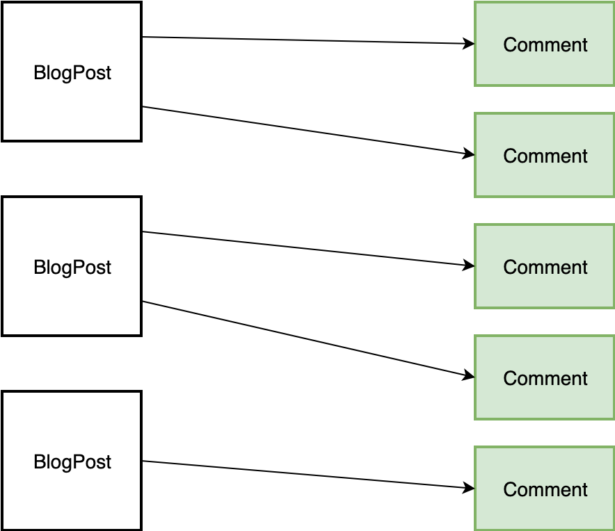

## One-to-Many relations

An example one-to-many relation diagram:



## Database design


With one-to-many relation, 1 record from first table (eg. `blog_posts`) has zero or more matching records on the other table (eg. `comments`).

One of the tables needs to have a column that will hold the `id` of the record on the other table.

In our example, we have `blog_posts` and `comments`. `BlogPost` can be related to 1, 2, 3...n `Comment`, so the relation has to be stored inside `Comment`.

In short:

* has* - methods on Models that own the relation, no relation column
* belongs* - methods on Models that are other side of the relation, with relation column

In the example above each `BlogPost` model has zero or more `Comment`.

## Defining relations

The relation on `BlogPost` model:

```
class BlogPost extends Model
{
    public function comments()
    {
        return $this->hasMany('App\Comment');
    }
}
```

Relation on `Comment` model:

```
class Comment extends Model
{
    public function blogPost()
    {
        return $this->belongsTo('App\BlogPost');
    }
}
```

## Migrations

`BlogPost` already exists and requires no changes.

`Comment` model migration:

```
Schema::create('comments', function (Blueprint $table) {
    $table->increments('id');
    $table->timestamps();
    $table->string('content');

    $table->unsignedInteger('blog_post_id')->index();
    $table->foreign('blog_post_id')->references('id')->on('blog_posts');
});
```